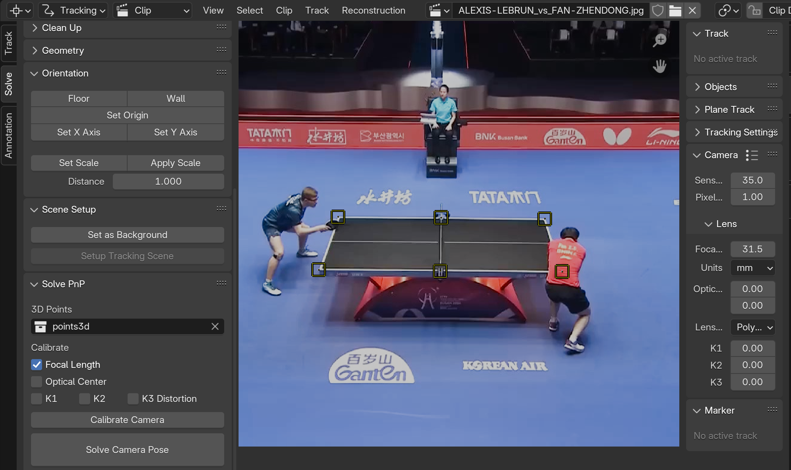
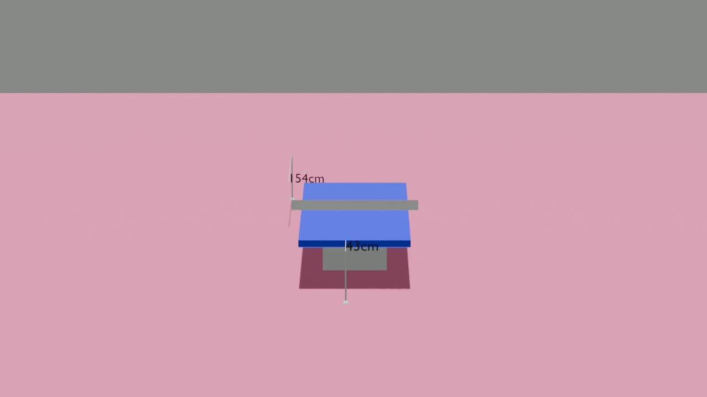
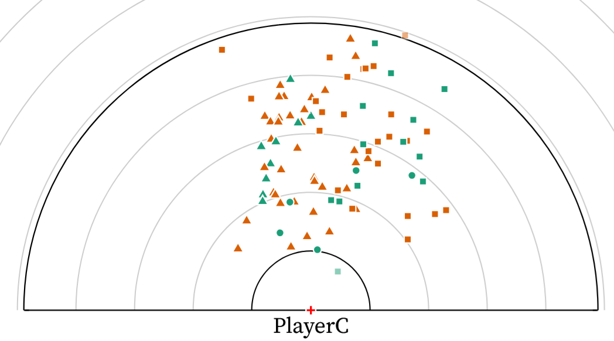

# Player Centric Referentiel
This repo explain how to generate 3D scene of table tennis points.
To create this scene, we used the API of Blender bpy. We provided a script to create scene with the table, players and ball position for each frame and the camera. We also provided a script to create a video of the point generated in the 3D scene.  

## Steps
### 1. Install
- Download MMPose https://github.com/open-mmlab/mmpose
- ```bash
   pip install -r requirements.txt
   ```
- Download Blender https://www.blender.org/download/ (recommanded)


### 2. Pose estimation
To estimate player positions we use position of players' feet by using pose estimation with mmpose 
To generate pose estimation on a table tennis point video:  
- Use `lancer_mmpose_sur_video()` from [test_mmpose_inference.py](https://github.com/centralelyon/tt-player-centric/blob/main/test_mmpose_inference.py)
  - Params:
    - video_path
    - output_csv
(We need a video of a single camera with only one point)

This function create a csv file with all players positions and with a tracking provided

### 3. Calibrate camera
If you we don't know intrisec camera parameters, we can estimate them with OpenCv functions such as `slovepnp()` or `calibrateCamera()`. These functions can be used directly inside blender with https://rtstudios.gumroad.com/l/camera_pnpoint 
To estimate these parameters, we can use 6 known points from the table

We need to create a json with these parameters (exemple: https://github.com/centralelyon/tt-player-centric/blob/main/exemple/PRITHIKA-PAVADE_vs_SIBEL-ALTINKAYA_camera.json)


## 4. Create video of player's position
To create the video we need more annotated data. We need to annotate more informations such as rebounce positions, hit positions and compute 3D ball trajectories.
We provided an exemple with all necessary files to create the video. All this are in folder exemple.
To generate video
`python render_image.py`


## 5. Create csv with new referentiel
To create the csv with coordonates in the new referentiel we need to use `create_csv_new_ref()` from [utils.py](https://github.com/centralelyon/tt-player-centric/blob/main/utils.py)
exemple:
`create_csv_new_ref("exemple/set_1_point_8_annotation_enrichi.csv","exemple/set_1_point_8_position_ordonne.csv")`

Exemple of new referentiel points ploted:



